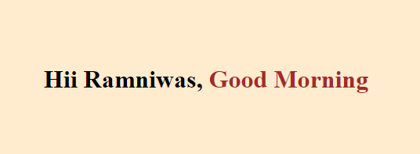
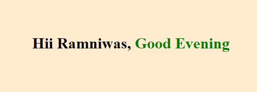
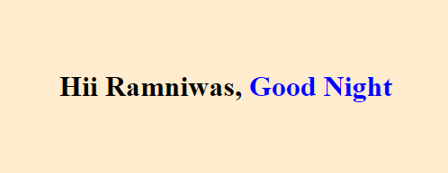

# Challenge-04

1. Create a React app from Scratch.

2. Show a heading that says Hello Sir, Good Morning,
    - if time is between 1 to 11 am
>   
3. Hello Sir, Good After Noon
    - if time is between 12 pm to 5 pm
>       
4. Hello Sir, Good Evening 
    - if time is between 6 pm to 8 pm 
>   
5. Hello Sir, Good Night
    - if time is between 9 pm till midnight
>   

6. Apply CSS in it, then dynamically change the color of greeting parts 
   only using inline CSS Style. 
    Ex. Brown, Red, green, blue etc.....

